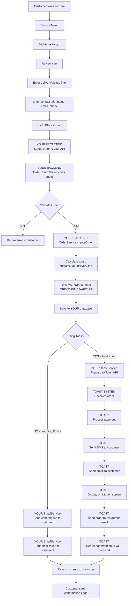
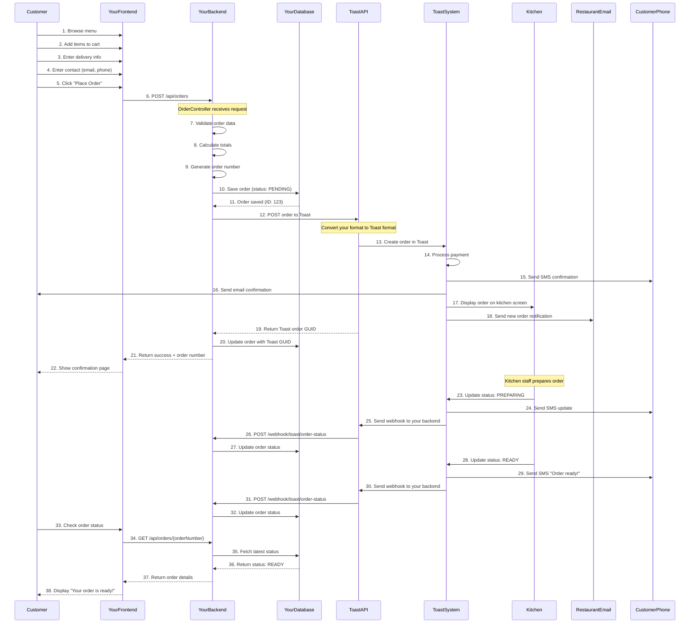

# Pita Shack Restaurant System Flow Diagram

## Complete Customer Journey: Website → Your Backend → Toast POS

---

## 📱 Customer Journey Flow



---

## 🔄 Detailed Production Flow (With Toast Integration)



---

## 🎯 System Components Breakdown

### **YOUR RESPONSIBILITY (What You Build)**

```
┌─────────────────────────────────────────────┐
│           YOUR CUSTOM FRONTEND              │
│                                             │
│  • Menu browsing UI                         │
│  • Shopping cart                            │
│  • Checkout form                            │
│  • Order confirmation page                  │
│  • Order status tracking page               │
│  • Custom branding (Pita Shack colors/logo) │
│                                             │
└─────────────────┬───────────────────────────┘
                  │
                  │ REST API calls
                  │
┌─────────────────▼───────────────────────────┐
│        YOUR BACKEND (Spring Boot)           │
│                                             │
│  • MenuItemController                       │
│  • OrderController                          │
│  • MenuItemService                          │
│  • OrderService                             │
│  • ToastService (integration layer)         │
│  • EmailService (backup/learning)           │
│                                             │
└─────────────────┬───────────────────────────┘
                  │
                  │ Database queries
                  │
┌─────────────────▼───────────────────────────┐
│          YOUR DATABASE (H2/MySQL)           │
│                                             │
│  • Menu items (or synced from Toast)        │
│  • Orders (with Toast GUID reference)       │
│  • Order status (synced via webhooks)       │
│                                             │
└─────────────────────────────────────────────┘
```

### **TOAST'S RESPONSIBILITY (What They Handle)**

```
┌─────────────────────────────────────────────┐
│              TOAST API                      │
│                                             │
│  • Receives orders from your backend        │
│  • Sends webhooks for status updates        │
│  • Manages payment processing               │
│                                             │
└─────────────────┬───────────────────────────┘
                  │
                  │
┌─────────────────▼───────────────────────────┐
│           TOAST SYSTEM                      │
│                                             │
│  ✅ Payment processing (credit cards)       │
│  ✅ Email notifications to customer         │
│  ✅ SMS notifications to customer           │
│  ✅ Kitchen display system                  │
│  ✅ Receipt printing                        │
│  ✅ Staff management interface              │
│  ✅ Order status tracking                   │
│  ✅ Analytics & reporting                   │
│  ✅ Inventory management                    │
│                                             │
└─────────────────────────────────────────────┘
```

---

## 📦 What Happens to Each Component

### **1. Customer's Shopping Cart** (Your Frontend)
```
Customer sees:
┌─────────────────────────────────┐
│  🛒 Your Cart                   │
│  ─────────────────────────────  │
│  2x Chicken Shawarma    $16.00  │
│  1x Falafel Wrap        $8.00   │
│  1x Hummus & Pita       $6.00   │
│  ─────────────────────────────  │
│  Subtotal:             $30.00   │
│  Tax (8%):              $2.40   │
│  Delivery Fee:          $5.00   │
│  ─────────────────────────────  │
│  TOTAL:                $37.40   │
│                                 │
│  [Proceed to Checkout]          │
└─────────────────────────────────┘
```

### **2. Order Data Sent to Your Backend**
```json
POST /api/orders
{
  "customerName": "John Doe",
  "customerEmail": "john@example.com",
  "customerPhone": "+1-555-123-4567",
  "orderType": "delivery",
  "deliveryAddress": "123 Main St, Apt 4B",
  "specialInstructions": "Extra sauce please!",
  "items": [
    {
      "menuItemId": 1,
      "quantity": 2
    },
    {
      "menuItemId": 3,
      "quantity": 1
    },
    {
      "menuItemId": 5,
      "quantity": 1
    }
  ]
}
```

### **3. Your Backend Processing**
```
OrderService.createOrder():
  ├── Validate menu items exist
  ├── Calculate subtotal: $30.00
  ├── Calculate tax (8%): $2.40
  ├── Add delivery fee: $5.00
  ├── Calculate total: $37.40
  ├── Generate order number: ORD-20251106-XYZ789
  ├── Set status: PENDING
  └── Save to database
```

### **4. Data Sent to Toast**
```json
POST https://ws-api.toasttab.com/orders/v2/orders
{
  "restaurantGuid": "abc-123-def-456",
  "customer": {
    "firstName": "John",
    "lastName": "Doe",
    "email": "john@example.com",
    "phone": "+1-555-123-4567"
  },
  "checks": [{
    "selections": [
      {
        "itemGuid": "toast-item-1",
        "quantity": 2,
        "price": 8.00
      },
      {
        "itemGuid": "toast-item-3",
        "quantity": 1,
        "price": 8.00
      },
      {
        "itemGuid": "toast-item-5",
        "quantity": 1,
        "price": 6.00
      }
    ]
  }],
  "deliveryInfo": {
    "address": "123 Main St, Apt 4B"
  }
}
```

### **5. Toast's Automated Actions**
```
Toast receives order → Triggers automatically:
  ├── Process payment (credit card charge)
  ├── Send SMS to +1-555-123-4567:
  │   "Hi John! Your order #ORD-20251106-XYZ789
  │    confirmed. Total: $37.40. Estimated time: 30 min"
  │
  ├── Send email to john@example.com:
  │   (Full order details, receipt, etc.)
  │
  ├── Display on kitchen screen:
  │   ┌────────────────────────────┐
  │   │ 🔔 NEW ORDER #789          │
  │   │ Delivery to: 123 Main St   │
  │   │ 2x Chicken Shawarma        │
  │   │ 1x Falafel Wrap            │
  │   │ 1x Hummus & Pita           │
  │   │ Notes: Extra sauce please! │
  │   │ [Accept] [Reject]          │
  │   └────────────────────────────┘
  │
  ├── Send email to restaurant owner
  │
  └── Print receipt at kitchen printer
```

### **6. Kitchen Updates Order Status**
```
Kitchen staff taps button on Toast tablet:
  [Accept Order] → Status: CONFIRMED
    ↓
  Toast sends SMS: "Your order is confirmed and being prepared"
    ↓
  Toast sends webhook to your backend:
    POST /webhook/toast/order-status
    {
      "orderGuid": "toast-guid-123",
      "status": "CONFIRMED"
    }
    ↓
  Your backend updates database: status = CONFIRMED

  ───────────────────────────────

  [Mark as Preparing] → Status: PREPARING
    ↓
  Toast sends SMS: "Your order is being prepared"
    ↓
  Toast webhook → Your backend updates status

  ───────────────────────────────

  [Ready for Pickup/Delivery] → Status: READY
    ↓
  Toast sends SMS: "Your order is ready for delivery!"
    ↓
  Toast webhook → Your backend updates status

  ───────────────────────────────

  [Complete] → Status: COMPLETED
    ↓
  Toast sends SMS: "Your order has been delivered. Enjoy!"
    ↓
  Toast webhook → Your backend updates status
```

### **7. Customer Checks Status on Your Website**
```
Customer visits: yourwebsite.com/orders/ORD-20251106-XYZ789

Your frontend calls: GET /api/orders/ORD-20251106-XYZ789

Your backend queries database (status synced from Toast webhooks)

Customer sees:
┌─────────────────────────────────────────┐
│  Order #ORD-20251106-XYZ789             │
│  ─────────────────────────────────────  │
│  Status: 🚚 Out for Delivery            │
│  ─────────────────────────────────────  │
│  ✅ Order Placed        2:30 PM         │
│  ✅ Confirmed           2:31 PM         │
│  ✅ Preparing           2:35 PM         │
│  ✅ Ready               3:00 PM         │
│  🚚 Out for Delivery    3:05 PM         │
│  ⏳ Delivered           Estimated 3:30  │
│  ─────────────────────────────────────  │
│  Estimated Delivery: 3:30 PM            │
└─────────────────────────────────────────┘
```

---

## 🔁 Order Status Lifecycle

```
┌──────────┐
│ PENDING  │ ← Order created in your system
└────┬─────┘
     │
     │ Restaurant accepts via Toast tablet
     ▼
┌───────────┐
│ CONFIRMED │ ← Toast sends webhook to your backend
└────┬──────┘
     │
     │ Kitchen starts cooking
     ▼
┌───────────┐
│ PREPARING │ ← Toast sends SMS to customer + webhook to you
└────┬──────┘
     │
     │ Food is ready
     ▼
┌────────┐
│ READY  │ ← Toast sends "Order ready!" SMS + webhook
└────┬───┘
     │
     │ Delivered/Picked up
     ▼
┌───────────┐
│ COMPLETED │ ← Toast sends final confirmation + webhook
└───────────┘
```

---

## 💡 Key Takeaways

### **You Control:**
✅ Customer-facing website design
✅ Shopping cart experience
✅ Menu presentation
✅ Order submission flow
✅ Order status display
✅ Your branding

### **Toast Controls:**
✅ Payment processing (PCI compliance)
✅ Kitchen operations (displays, printers)
✅ Staff management
✅ Customer notifications (SMS/Email)
✅ Order status workflow
✅ Analytics & reporting

### **Data Flow:**
```
Customer Input (Your Site)
  → Your Backend (Validate & Save)
    → Toast API (Process Everything)
      → Webhooks Back to You (Status Updates)
        → Your Frontend (Display to Customer)
```

---

## 🎨 Visual Analogy

Think of it like **Uber Eats / DoorDash**:

**Your system** = The Uber Eats customer app (ordering interface)
**Toast system** = The Uber Eats restaurant backend (kitchen management, notifications)

When a customer orders on Uber Eats:
- They see Uber's interface (like your frontend)
- Uber sends order to restaurant's system (like Toast)
- Restaurant manages it in their system
- Customer gets updates from both

---

**Created:** 2025-11-06
**Purpose:** Visual guide for understanding system architecture and data flow
